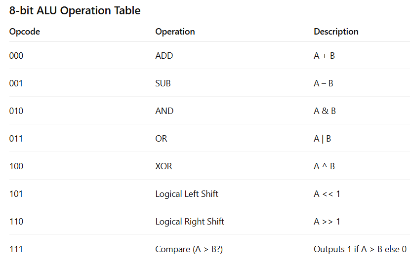
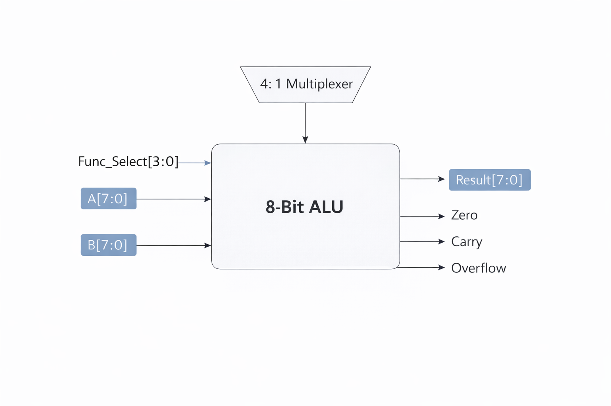
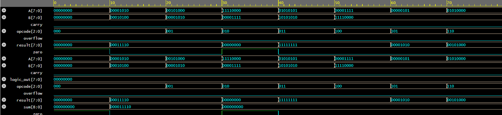

# 8-bit ALU – SystemVerilog Project
A **8-bit Arithmetic Logic Unit (ALU)** implemented using **SystemVerilog RTL** and verified using  
a **self-checking testbench**, **assertions**, and **functional coverage**.


---

##  ALU Overview


###  ALU Block Diagram  



###  ALU Waveform Output  



---

##  Features Implemented

### RTL Design  
The ALU supports:

- Addition  
- Subtraction  
- AND  
- OR  
- XOR  
- Logical Left Shift  
- Logical Right Shift  
- Equality Check  
- Greater-Than Comparison  
- Status Flags: **Zero, Carry/Borrow, Overflow**

### Verification Components  
- **Self-checking Testbench**
- **Assertions (SVA)**  
  - ADD overflow validation  
  - Zero flag correctness  
  - Carry/Borrow correctness  
  - Logic operations carry check  
- **Functional Coverage**
  - Operation bins  
  - Flag coverage  
  - Cross-coverage (operation × result type)  


---

##  Tools Used
- **Synopsys VCS** – Compilation & Simulation    
- **VS Code** – Code editor
- **Platform** - EDA Playground
---
##  Simulation Instructions (Run using VCS)


### 1️ Compile
```bash
vcs -sverilog alu.sv alu_tb.sv alu_assertions.sv alu_coverage.sv -o simv
```


### 2️ Run Simulation
```bash
./simv
```


---

##  What I Learned from This Project
- Designing an ALU using SystemVerilog RTL
- Writing clean, reusable testbenches
- Verifying hardware using SVA (Assertions)
- Designing functional coverage for completeness
- Debugging RTL using VCS
- Using EDA Playground for small verification setups
- Organizing professional GitHub repositories  

---

##  Author
**Viki**  
Aspiring VLSI Verification Engineer 


